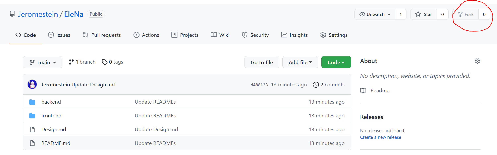

# How to make a contribution

## 1. Fork in Github

Click **Fork** button in this page (https://github.com/Jeromestein/EleNa) and then you can find this project repo in your account page.



## 2. Clone repo locally

In your local machine, use

```bash
git clone [your EleNa repo's github address]
# for example,
git clone https://github.com/xxxx/EleNa.git
```

And then, you will get a folder in your local machine.


## 3. Add remote address

In your folder, open bash and use

```bash
git remote add upstream https://github.com/Jeromestein/EleNa.git
```

to add remote address.

## 4. Update your repo

```bash
git pull upstream master 
```


## 5. Checkout a new branch

Normally, we **don’t use master branch to commit and push** new code. Instead,  we create a new branch for every new feature or bug fix.

```bash
git checkout -b my_change_xxx 
```


## 6. Add code, commit 

Use `git add ` and `git commit` to commit your work.


## 7. Merge before Pull Request

A high frequent issue is that the remote upstream has been updated before our commit, which leads to the conflicts. So we could manually merge our code before commit.

```bash
git chekcout master				# go to master branch
git pull upstream				# pull the latest code from remote repo
git checkout my_change_xxx		# go back to your change branch
git rebase master				# simplfy the git log history

# push your code to your *own* Github repo
git push origin my_change_xxx
```


## 8. Pull Request

Pull Request in your **own** Github repo and simply describe your implementation.


## 9. Review and merge to main repo

We will review your code and make sure everything works well. And then your code will be merged into main repo.

